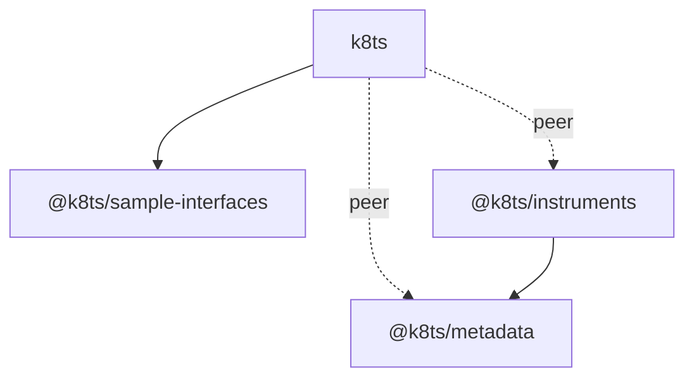

# Repository Guide
The k8ts monorepo centers around the [k8ts](../packages/k8ts/README.md) project for building k8s manifests using TypeScript.

See [coding](./contrib/coding.md) for info about some coding tricks used by the packages.

Basic configuration for all packages:

```yaml
runtime: Node.js v22
module system: CommonJS
TypeScript: 5.8
module resolution: node16 # allows resolving package exports fields
linking: yarn workspaces with "workspace:^" refs
```

# Naming convention
Follows several naming conventions:

1. Standard, commonly used members have simple names, e.g. `Deployment`
2. More specialized classes/types have compound names like `Service_Port` or `Container_Volume_Mount`.

Some specific files still use namespaces to organize declarations. Except for the kind structures these should be extracted and the convention used. Namespaces aren't well-supported and create issues.

# Packages
The monorepo organizes code into multiple packages. Some of the packages are pretty big and contain lots of stuff. These should be spun off into smaller packages over time.

## k8ts
The primary front-facing package. Includes several different parts that should be spun off:

1. K8s entity definitions, like Deployment and Pvc.
2. Origin entity definitions, including File and the topmost World.*
3. Subentity definitions, like containers, pods, pod volumes, etc.
4. The manifest assembler that turns objects to YAML content*
5. Recognized resource kinds in a namespace configuration.*

Things marked wiht `*` should be spun out into their own packages.

Requires `@k8ts/metadata` and `@k8ts/instruments` as peer dependencies, and users need to install both to use the system. `@k8ts/sample-interfaces` is also used, but it's a normal dependency and relevant contents are re-exported.

## @k8ts/instruments
A range of utilities and core components for k8ts. Includes a lot of unrelated stuff in organized by deep directory trees. Requires `@k8ts/metdata` as a peer-dependency.

This is very much a grab bag package and needs to be split into several smaller packages around each of its components.
### Core
Core building blocks for k8s resource entities.

1. Resource, entity, node, and origin base classes.
2. Current origin tracker which includes an iterator hook.
3. Exports objects and FwReference proxy objects.
4. Type mechanisms for computing reference structures

### Expressions
Abstractions commonly used when defining other resources.

1. Port and IP address abstractions.
2. Container image, command lines, and environment variables for defining containers.
3. Data sources, which are used to populate ConfigMaps and Secrets with build-local data.
4. Abstractions for the resource units and the request-limit system.
5. Parsers for the concise `10Gi --> 20Gi` request-limit shorthand.
6. Re-exported time zone types.

### Utils
Various utilities typically unrelated to k8s.

## @k8ts/metadata
Abstractions for k8s metadata, which includes everything that appears in the `metadata` field, like labels, namespaces, annotations, etc.

Each instance is mutable and unique. It's expected to be mutated by users. Uses a concise syntax for referencing different annotation types:

```yaml
name: The name
namespace: the namespace
"%app": Label
"^app": Annotation
"#app": Comment # not reproduced by the manifester, treated as build-only metadata
```

Validates metadata at the type and runtime levels. Very focused and is a good example of what a k8ts dependency package should look like.

## @k8ts/sample-interfaces
These are type definitions for k8s manifests themselves, typically interfaces. They were generated using cdk8s and serve as a stopgap until k8ts has its own type generator.

Should be replaced with a type generator using [zenesis](https://github.com/gregros/zenesis) once that package is published.
# Compilation
All `src` parts of packages are compiled to JS, while `test` parts are instead executing using `jest` or `tsx`. This is because `src` can have potentially long compile times.

Refernces between projects make sure that everything compiles when needed. This also allows a `tsc -b .` at the root to compile everything by referencing all the projects.

The same build commands are available inside packages and at the root:

```yaml
yarn run build: 
  at root: compiles everything using tsconfig references
  at package: compiles the package and sometimes dependencies
yarn run watch:
  at root: watches everything using tsconfig references # VSCODE TASK: tsc watch [global]
  at package: watches the current package and sometimes deps
yarn run build:clean: deletes compilation products and runs "yarn run build"
```

Each package's `package.json` points to its `dist/` folder:

```json
{
  "main": "dist/index.js",
  "types": "dist/index.d.ts"
}
```

# Other scripts
At root:

```yaml
yarn run install:all: Runs "yarn install" in all workspaces
yarn run tidy: Runs install:all, lint:fix, build:clean, and test
```

# Package Dependency Structure



Direct dependencies use solid lines. Peer dependencies (installed by the user alongside k8ts) use dashed lines. The `metadata` package sits at the bottom with no internal dependencies, `instruments` builds on it, and `k8ts` integrates everything.

`k8ts` exporst the type namespace called `CDK` which exposes interface definitions for k8s manifests.

# TypeScript Configuration Structure
The root `tsconfig.json` acts as the build orchestrator, defining project references to all packages. Each package has a top-level `tsconfig.json` with `"composite": true` and `"noEmit": true` that references its internal sub-projects (`src/`, `test/`, `example/`).

## Root Project References

A YAML representation of the `tsconfig.json` project references:

```yaml
/tsconfig.json:
  /packages/sample-interfaces/tsconfig.json:
  /packages/metadata/tsconfig.json:
  /packages/instruments/tsconfig.json: 
  /packages/k8ts/tsconfig.json:

/packages/sample-interfaces/tsconfig.json:
  ./src/tsconfig.json:

/packages/k8ts/tsconfig.json:
  ./src/tsconfig.json:
    /packages/instruments/tsconfig.json: 
    /packages/metadata/tsconfig.json: 
    /packages/sample-interfaces/tsconfig.json: 
    
  ./test/tsconfig.json:
    ../src/tsconfig.json: 

  ./example/tsconfig.json:
    ../src/tsconfig.json: 

/packages/instruments/tsconfig.json:
  ./src/tsconfig.json:
    /packages/metadata/tsconfig.json: 

  ./test/tsconfig.json:
    ../src/tsconfig.json: 

/packages/metadata/tsconfig.json:
  ./src/tsconfig.json: 

  ./test/tsconfig.json:
    ../src/tsconfig.json:

```

Files are compiled as follows:

```yaml
packages/k8ts/src/**/*.ts: packages/k8ts/dist/**/*
packages/k8ts/examples/**/*.ts:  packages/k8ts/dist_examples/**/*
packages/instruments/src/**/*.ts: packages/instruments/dist/**/*
packages/metadata/src/**/*.ts: packages/metadata/dist/**/*
packages/sample-interfaces/src/**/*.ts: packages/sample-interfaces/dist/**/*
```

# VS Code Workspace
The workspace configuration lives in [k8ts.code-workspace](../k8ts.code-workspace). It defines a workspace root for each package, plus one called `root` for the root.

When the workspace is opened, the `tsc watch [global]` task runs automatically.

# Repository Management Scripts
The root [package.json](../package.json) defines scripts for working with the entire monorepo. Key commands:

## Build

- `build` - Compile all packages in dependency order
- `watch` - Compile in watch mode for active development
- `build:clean` - Remove all build artifacts, then rebuild

## Test

- `test` - Run tests in all packages (topological order)

## Lint and Format

- `prettier:check` - Check code formatting
- `prettier:fix` - Auto-format all code
- `eslint:check` - Run ESLint on TypeScript files
- `eslint:fix` - Auto-fix linting issues
- `lint:check` - Run formatting checks (currently just Prettier)
- `lint:fix` - Auto-fix all linting and formatting

## Maintenance

- `clean` - Remove `dist/` folders from all packages
- `fix:install` - Reinstall dependencies everywhere (root + all packages)
- `tidy` - **The full quality gate**: install, format, clean build, test

## Yarn Workspaces
The root `package.json` declares `"workspaces": ["packages/*"]`, enabling Yarn to manage dependencies across packages. Commands like `yarn workspaces foreach` run scripts in parallel where possible.

# Linting
The repository uses **ESLint** and **Prettier** for code quality. They are only installed at the repo root and configured to run across all packages.

They can be run using the following commands:

```yaml
yarn run eslint:check: runs eslint in check mode
yarn run prettier:check: runs prettier in check mode
yarn run eslint:fix: auto-fixes eslint issues
yarn run prettier:fix: auto-formats code
yarn run lint:fix: runs both eslint and prettier fixes
yarn run lint:check: runs both eslint and prettier checks
```

The configurations are defined as follows:

```yaml
eslint:
  version: 9
  config: eslint.config.mjs
  plugins:
    ignore: ignores files that aren't source code
    eslint-plugin-markdown: decomposes markdown code blocks so they can be formatted by language
    stylistic: |
      we don't use prettier to format code blocks because documentation needs careful indentation and
      formatting that prettier would break; we instead use stylistic to fix specific formatting
      issues.
    typescript: the eslint typescript plugins
  rules: customized

prettier:
  version: 3
  config: .prettierrc.json
  plugins:
    prettier-plugin-jsdoc: formats jsdoc comments
    prettier-plugin-organize-imports: sorts imports
    prettier-plugin-packagejson: organizes package.json files
  rules: customized
```
